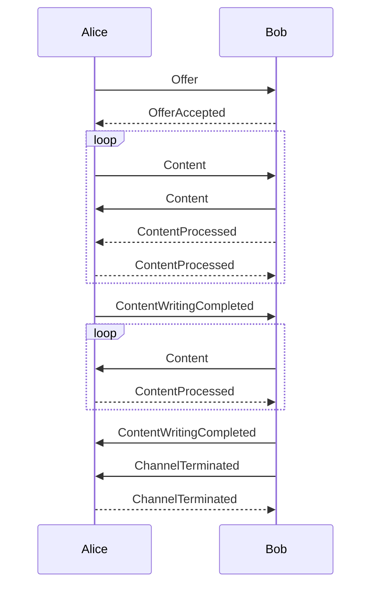

# MultiplexingStream protocol

The multiplexing stream is useful for isolating an arbitrary number of channels over a single duplex connection between two parties, which may be in the same process or across a network.
This document describes the protocol used so that other implementations can be written that interoperate with it.
There are 3 major versions of the protocol.

The usage documentation for the implementation in this repo can be found [here](../docs/MultiplexingStream.md).

## High level interactions

All protocol versions have several use cases and supporting message sequences in common, and are outlined here:

### Channel lifecycle

The following sequence outlines the creation, use and destruction of a channel:

These messages are exchanged over a duplex connection and where logical sequence allows, these messages may be transmitted in parallel to each other.

### Backpressure

An individual channel that writes faster than the other party can read it may flood memory of the receiving process unless the transmission can be throttled.
The `ContentProcessed` message facilitates this throttling, also known as backpressure.

Backpressure is not supported in v1 of the protocol.

When a channel is created, each party has an opportunity to disclose the size of their "receiving window", which is the number of bytes the remote party can send them before pausing to wait for a `ContentProcessed` message.
When sending content, the sender must keep track of the number of bytes that it has transmitted minus the number of bytes that the receiving party indicates they have processed.
The sender is responsible to ensure that this number never exceeds the remote party's receiving window size.

If the receiving window size is exceeded, it is a protocol violation and the whole connection may be forcibly closed.

### Channel termination

Every channel is created in duplex mode, allowing both parties to send content to the other party in parallel.
If and when one party knows it will not write any more bytes, it should send a `ContentWritingCompleted` message to the other party.
When both parties have received such messages, the channel should be terminated.
This is a clean teardown of a channel because all bytes sent by both parties are confirmed to have been received.

A channel *may* be terminated by either party before these `ContentWritingCompleted` messages have been exchanged, but this is considered a dirty teardown and should be the result of a fatal error on the party of one of the parties sharing the channel.

A party that has sent a channel termination message MUST NOT transmit an further messages regarding that channel.

## Networking primitives

### Frame

Every message is delivered in a frame.
A frame has this structure:

- Header
  - Control code
  - Channel ID
- Payload

The details of how the structure is encoded varies by major protocol version and is documented in later sections.

### Control codes

| Control code | Value | Purpose |
|--------------|-------|---------|
| `Offer` | 0 | A channel is proposed to the remote party. |
| `OfferAccepted` | 1 | A channel proposal has been accepted. |
| `Content` | 2 | The payload of the frame is a payload intended for channel consumption. |
| `ContentWritingCompleted` | 3 | Sent after all bytes have been transmitted on a given channel. Either or both sides may send this. A channel may be automatically closed when each side has both transmitted and received this message. |
| `ChannelTerminated` | 4 | Sent when a channel is closed, an incoming offer is rejected, or an outgoing offer is canceled. |
| `ContentProcessed` | 5 | Sent when a channel has finished processing data received from the remote party, allowing them to send more data. |

### Channel IDs

Every channel has an ID, which includes an integer.
The ID includes an identifying marker or characteristic that ensures it is unique across all channels created by either party.

#### Channel ID uniqueness

Because channels can be created by either party in parallel, a means is established to ensure that each party never creates an ID that collides with the ID of a channel that may be created by the other party.

Channel IDs SHOULD NOT be reused, in order to help identify ordering bugs in message transmission.
In the future, it MAY be allowed to recycle a channel ID after both sides have received channel termination messages regarding that channel.

In versions 1 and 2 of the protocol, channel IDs are guaranteed to be unique between parties by establishing an "odd" party.
In any multiplexing stream, exactly one party is "odd".
This party will create channels and assign them odd numbers, starting with 1.
The non-odd party (i.e. the "even" party) will create channels and assign them even numbers, starting with 2.

In version 3 of the protocol, the concept of odd party is removed.
Both parties can assign any integer as a *part* of an ID to a channel they create.
The whole channel ID is guaranteed to be unique because every time the ID is serialized in the protocol, it includes both the integer and a flag that indicates whether the channel was created by the transmitting or the receiving party.
More details on this can be found in the version 3 protocol documentation in later sections.

### Payload

The payload contains additional data that supports the operation identified by the control code.
The most common example is the content being sent over a channel.

The details of how payloads are encoded vary across major protocol versions and are documented in later sections.

## Version 1

Encoding is done using a proprietary binary format.

This version of the protocol shares the concept of an 'odd' party with version 2 of the protocol.

### Handshake

## Version 2

All encoding is done using [the msgpack binary format](https://msgpack.org/).

This version of the protocol shares the concept of an 'odd' party with version 1 of the protocol.

### Handshake

The handshake packet is sent from both sides in parallel.
This handshake has two purposes:

1. Establish which party will create odd numbered channel IDs.
1. Confirm that both sides are communicating with the same protocol and version.

The handshake packet is the msgpack encoding of the following array:

Index | Type | Description | Required |
--|--|--|--
0 | array | Protocol version `[major, minor]` | true
1 | binary | 16 bytes of random data | true

After sending this handshake packet, a handshake packet should be read and decoded from the duplex stream.

The protocol version should be compared with its own version to see if it is compatible.

The random data is used to establish which party is 'odd' as follows:

1. Search for the first byte that is not equal between the sent and received random data.
1. The local party is 'odd' if and only if the *sent* byte is *greater* than the received byte at the same index.

### Frame

The frame is written as the msgpack encoding of an array as follows:

Index | Type | Description | Required |
--|--|--|--
0 | integer | Control code | Yes
1 | integer | Channel ID | Yes
2 | binary | Payload | No

### Offer

See version 3 of the protocol for how the payload for this frame is serialized.

### OfferAccepted

See version 3 of the protocol for how the payload for this frame is serialized.

### ContentProcessed

See version 3 of the protocol for how the payload for this frame is serialized.

## Version 3

Like version 2, all encoding is done using [the msgpack binary format](https://msgpack.org/).

### Handshake

There is no handshake at the start of a connection in this version.

### Frame

The frame is written as the msgpack encoding of an array as follows:

Index | Type | Description | Required |
--|--|--|--
0 | integer | Control code | Yes
1 | integer | Channel ID | Yes
2 | integer | Channel Source | Yes
3 | binary | Payload | No

The payload content depends on the control code and is documented in the following sections.

### Offer

The payload for an `Offer` frame that is the msgpack encoding of an array with the following elements:

Index | Type | Description | Required
--|--|--|--
0 | String | Channel name | Yes
1 | Integer | Receiving window size | No

### OfferAccepted

The payload for an `OfferAccepted` frame that is the msgpack encoding of an array with the following elements:

Index | Type | Description | Required
--|--|--|--
0 | Integer | Receiving window size | No

### ContentProcessed

The payload for a `ContentProcessed` frame that is the msgpack encoding of an array with the following elements:

Index | Type | Description | Required
--|--|--|--
0 | Integer | Number of bytes processed | Yes
